---
## Front matter
title: "Отчёт по лабораторной работе №8"
subtitle: "дисциплина: Архитектура компьютера"
author: "Кудинец Максим Антонович"

## Generic otions
lang: ru-RU
toc-title: "Содержание"

## Bibliography
bibliography: bib/cite.bib
csl: pandoc/csl/gost-r-7-0-5-2008-numeric.csl

## Pdf output format
toc: true # Table of contents
toc-depth: 2
lof: true # List of figures
lot: true # List of tables
fontsize: 12pt
linestretch: 1.5
papersize: a4
documentclass: scrreprt
## I18n polyglossia
polyglossia-lang:
  name: russian
  options:
	- spelling=modern
	- babelshorthands=true
polyglossia-otherlangs:
  name: english
## I18n babel
babel-lang: russian
babel-otherlangs: english
## Fonts
mainfont: IBM Plex Serif
romanfont: IBM Plex Serif
sansfont: IBM Plex Sans
monofont: IBM Plex Mono
mathfont: STIX Two Math
mainfontoptions: Ligatures=Common,Ligatures=TeX,Scale=0.94
romanfontoptions: Ligatures=Common,Ligatures=TeX,Scale=0.94
sansfontoptions: Ligatures=Common,Ligatures=TeX,Scale=MatchLowercase,Scale=0.94
monofontoptions: Scale=MatchLowercase,Scale=0.94,FakeStretch=0.9
mathfontoptions:
## Biblatex
biblatex: true
biblio-style: "gost-numeric"
biblatexoptions:
  - parentracker=true
  - backend=biber
  - hyperref=auto
  - language=auto
  - autolang=other*
  - citestyle=gost-numeric
## Pandoc-crossref LaTeX customization
figureTitle: "Рис."
tableTitle: "Таблица"
listingTitle: "Листинг"
lofTitle: "Список иллюстраций"
lotTitle: "Список таблиц"
lolTitle: "Листинги"
## Misc options
indent: true
header-includes:
  - \usepackage{indentfirst}
  - \usepackage{float} # keep figures where there are in the text
  - \floatplacement{figure}{H} # keep figures where there are in the text
---

# Цель работы

Целью работы является приобретение навыков написания программ с использованием циклов и обработкой аргументов командной строки в NASM.

# Задание

1. Напишите программу, которая находит сумму значений функции f(x) для x = x1, x2, …, xn, т.е. программа должна выводить значение f(x1) + f(x2) + … + f(xn). Значения xi передаются как аргументы. Вид функции f(x) выбрать из таблицы 8.1 вариантов заданий в соответствии с вариантом, полученным при выполнении лабораторной работы № 7. Создайте исполняемый файл и проверьте его работу на нескольких наборах x = x1, x2 …, xn.

# Теоретическое введение

# Выполнение лабораторной работы

## 4.1 Реализация циклов в NASM

1. Создаю каталог для программ лабораторной работы №8, перехожу в него и создаю файл lab8-1.asm.

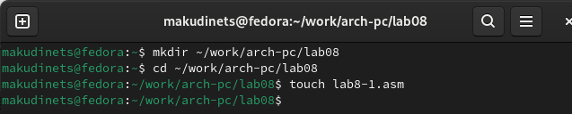{#fig:001 width=70%}

2. Ввожу в файл lab8-1.asm текст программы из листинга 8.1. Запускаю исполняемый файл.

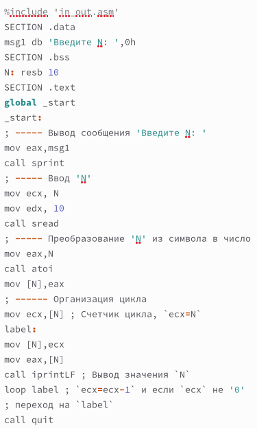{#fig:002 width=70%}
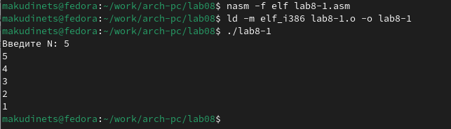{#fig:003 width=70%}

3. Изменим текст программы, добавив изменение значение регистра ecx в цикле. Запустим исправленную программу. Число проходов цикла не соответствует значению, введенному с клавиатуры.

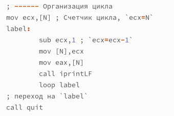{#fig:004 width=70%}
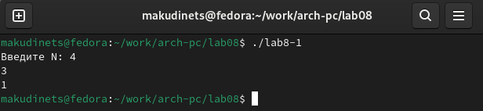{#fig:005 width=70%}

4. Внесем изменения в текст программы добавив команды push и pop (добавления в стек и извлечения из стека) для сохранения значения счетчика цикла loop. Запустим программу и проверим ее работу. Теперь число проходов цикла соответствует числу, введенному с клавиатуры.

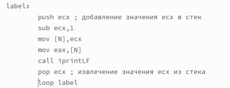{#fig:006 width=70%}
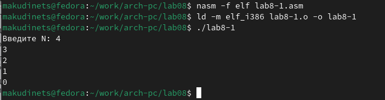{#fig:007 width=70%}

## 4.2 Обработка аргументов командной строки

5. Создаем файл lab8-2.asm. Вводим в него программу из листинга 8.2. Программа обработала 4 аргумента.

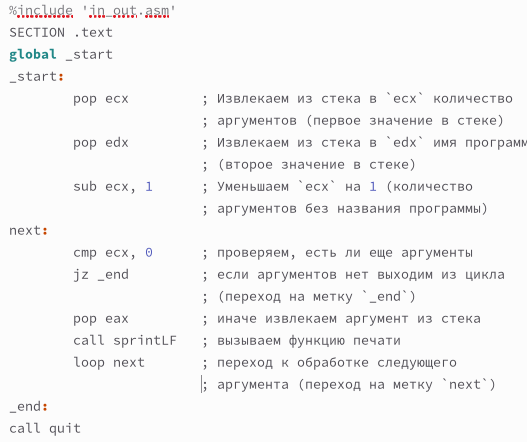{#fig:008 width=70%}
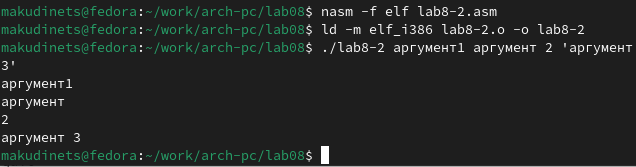{#fig:009 width=70%}

6. Создадим файл lab8-3.asm и введем в него текст программы из листинга 8.3.

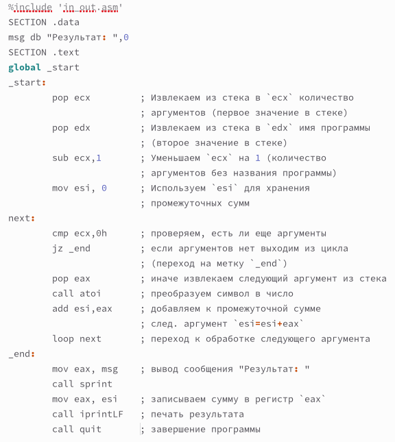{#fig:010 width=70%}
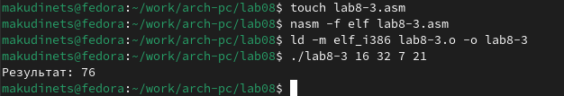{#fig:011 width=70%}

7. Изменяю текст программы для вычисления произведения аргументов командной строки.

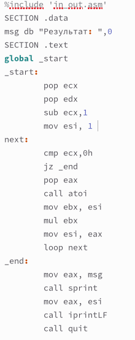{#fig:012 width=70%}
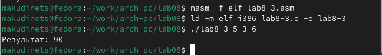{#fig:013 width=70%}

# 5 Задания для самостоятельной работы

1. Напишем программу, которая находит сумму значений функции f(x) для x=x1, x2, …, xn, т.е. программа должна выводить значение f(x1) + f(x2) + … + f(xn). Мой вариант - 10. Создадим исполняемый файл и проверим его работу на нескольких наборах x=x1, x2, …, xn. Программа работает корректно.

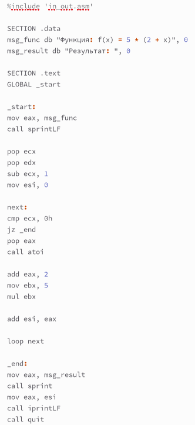{#fig:014 width=70%}
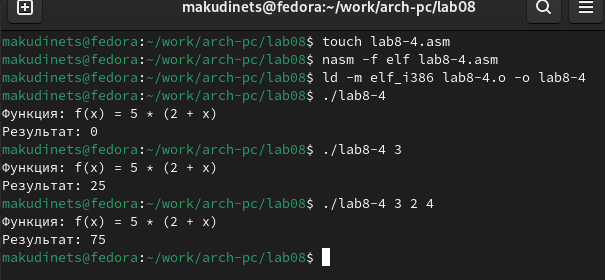{#fig:015 width=70%}

# Выводы

В результате выполнения лабораторной работы я приобрёл навыки написания программ с использованием циклов и обработкой аргументов командной строки в NASM.

# Список литературы{.unnumbered}

